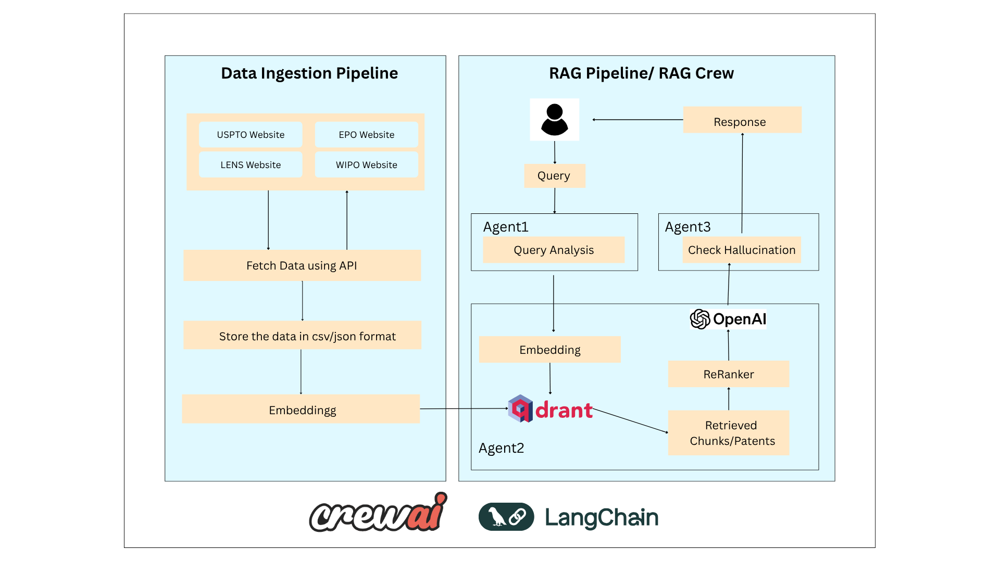

# 🚀 Patent Chat Assistant

A smart assistant that answers user questions about future technology trends (like innovations in lithium batteries) by checking and analyzing patent data. Built with a step-by-step decision flow using a Retrieval-Augmented Generation (RAG) pipeline and modular agent workflow.

---

## 💡 How It Works

### 1. User Asks a Question
The assistant receives a user query such as:
> _"Give me future innovations or emerging technologies related to lithium batteries"_

### 2. Understanding the Topic
- The system extracts the main topic from the user’s query.
- Example: "lithium battery"
- To save cost, we avoid expensive OpenAI LLM calls and instead plan to use an NER (Named Entity Recognition) model to extract the topic from the query.
- After extracting the entity, we can compare it with previously seen topics using **Jaccard similarity score** to avoid duplicates or near-duplicates.
- Other similar comparison techniques include **Cosine Similarity**, **Levenshtein Distance**, and **TF-IDF vector matching**.

### 3. Check if Data is Ready
- If the topic data **is already available**, the assistant proceeds to answer.
- If the topic is **being processed**, the assistant notifies the user.
- If the topic is **not available**, the assistant starts data ingestion pipeline in the background.

### 4. Three Possible Responses
- ⚡ **Processing**: _"We’re working on it. Please wait."_
- ❌ **Not Available**: _"We’re fetching patent data. Try again in a few hours."_
- ✅ **Available**: The assistant uses the RAG system to give a smart, informative answer.

### 5. When Data is Ready
- A Retrieval-Augmented Generation (RAG) pipeline is used to generate detailed answers using collected patent data.

- To reduce costs further, we use open-source BGE models for embedding generation instead of commercial LLM APIs.

---

## 🧠 Cost Optimization Strategy

- **On-the-request data fetching**: Since patent datasets are huge (in billions), storing everything is costly and inefficient. We only fetch data when a new topic is requested, which helps reduce storage costs.
- **Background data ingestion pipeline**: Instead of using an agent to trigger this, we use a simple pipeline to avoid unnecessary complexity and latency. Agents are better reserved for tasks needing reasoning or interaction.
- **Query cache system**: A local cache (query + timestamp) helps reduce duplicate LLM calls. Queries older than a defined threshold can be cleared to save space, while recent ones can be reused to reduce latency and cost.

---

## 📂 Patent Data Sources Used (and Limitations)

| Source | Description | Access Method | Status |
|--------|-------------|----------------|--------|
| **BigQuery (Google Cloud)** | Public patent datasets including USPTO, WIPO, etc. | SQL querying (paid) | - |
| **WIPO PATENTSCOPE** | Global patents via WIPO | Manual UI only | ❌ Web scraping not allowed, awaiting API access |
| **Espacenet (EPO)** | European patents and data | Manual interface only | ❌ Scraping disallowed, API access pending |
| **The Lens** | Patent and scholarly data platform | API after registration | ⏳ Access requested |
| **EPO Developer Portal** | European Patent Office API | Requires approval | ⏳ Waiting for API key |
| **USPTO PatentsView** | U.S. Patent API | Public REST API | ⏳ Waiting for access key |

---

## Architecture

## My Thoughts / Doubts / Assumptions on This Use Case

While designing the system to identify emerging technologies from patent documents using a RAG (Retrieval-Augmented Generation) approach, I had several questions and realizations that shaped my solution strategy. Here are my notes and assumptions based on analyzing the problem:

### 1. Can Patents Be Retrieved Using Keywords Like "Emerging Technology"?

Initially, I wondered whether patent documents would contain direct phrases such as:

* "emerging technology"
* "new approach"
* "innovative solution"

However, I found that patents are typically written in formal, legal language. They avoid subjective or speculative phrases and instead use structured wording like:

* "We claim a method for..."
* "An apparatus comprising..."
* "This invention relates to..."
* "The prior art fails to address..."

This means keyword-based retrieval using terms like "emerging" or "innovative" is unreliable. Patents don’t label themselves that way.

### 2. Post-Retrieval LLM Analysis for Novelty Detection

I plan to use an LLM-based agent to analyze retrieved chunks in a way that identifies what is **new or distinct** compared to prior art. This agent could:

* Compare current patent text against older documents
* Detect keyword trends over time (e.g., the rise of "sodium-ion")
* Identify documents with low similarity to previous patents (i.e., novelty proxies)

Approaches include:

* TF-IDF analysis for term emergence
* Cosine similarity comparisons between old and new embeddings
* Prompt-based comparison: “What differentiates this from previous inventions?”

### 3. Role of Metadata

To support fine-grained filtering, each vectorized chunk in the database should include metadata like:

* Year of publication
* IPC class / domain
* Keyword frequency trends
* Number of citations

This enables queries like:

* "Find post-2022 claims with rare keywords and no prior art overlap."

## 🌐 Future Enhancements
- Connect to real-time patent APIs once API keys are available
- Add summarization agents for deeper responses
- Build user dashboard 
- Improve cost-efficiency further using smarter caching and lighter-weight models
